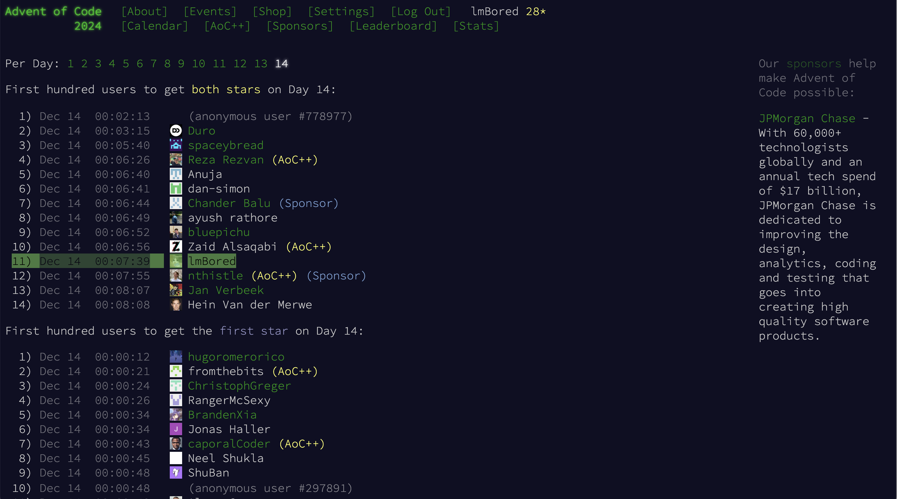

<!---
## 🔥 Github Stats

<table style="width: 100%; border: none;">
  <tr>
    <td style="width: 50%; text-align: center; vertical-align: top;">
      <h3>Github stats</h3>
      
    </td>
    <td style="width: 50%; text-align: center; vertical-align: top;">
      <h3>Streak stats</h3>
      
    </td>
  </tr>
</table>

<strong>Github Stats + Streak Stats</strong>
    
   

### Github stats

### Streak stats

### Contributions

|Github Stats |Github Streaks |
|:-:|:-:|

-->

## Rank 26th worldwide AoC_2024 Day 21

<!--  -->

 

## Rank 11th worldwide AoC_2024 Day 14

<!--  -->

 

---

 

<table width="100%" style="border:0px solid white; width:100%;">
  <tr>
    <th style="border: none;">Github Stats</th>
    <th style="border: none;">Github Streaks</th>
  </tr>
  <tr>
    <td width="33%" style="border:0px; width:33.33%">
      
    </td>
    <td width="33%" style="border:0px; width:33.33%">
      
    </td>
  </tr>
  <tr>
    <th width="33%" style="border:0px; width:33.33%" colspan="2">Contributions</th>
  </tr>
  <tr>
    <td width="33%" style="border:0px; width:33.33%" colspan="2" align="center">
      
    </td>
  </tr>
</table>
